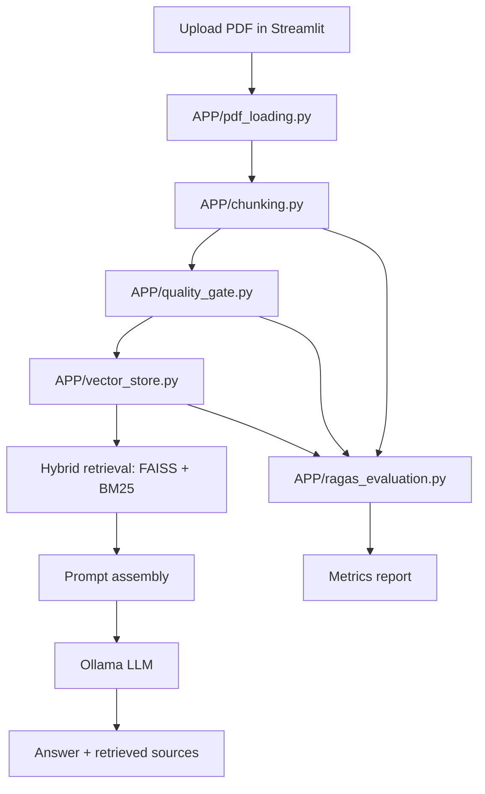

# Semantic Question Answering over Large Documents using RAG + LLaMA 3 + Ollama

<div align="center">

Local PDF question answering with hybrid retrieval, a Streamlit chat UI, quality gating, and a built-in evaluation pipeline.

<p>
  
  
  
  
  
  
</p>

</div>

## What this project does

This repository turns long PDFs into a local, retrieval-grounded chat system. You upload a document, it gets extracted, chunked, filtered through a quality gate, indexed with both dense and sparse retrieval, and then answered by a local Ollama model.

It also includes a separate evaluation harness that can generate QA pairs from the chunks, mix in out-of-distribution questions, and score the system with retrieval and answer-quality metrics.

## Highlights

- Local-first RAG with no external API keys required.
- Streamlit UI for upload, processing, retrieval, and chat.
- Hybrid retrieval with FAISS + BM25 and reciprocal rank fusion.
- Smart chunking with overlap and metadata preservation.
- Quality gate that scores chunks before indexing.
- PDF loader with `pdfplumber` and `pypdf` fallback.
- Evaluation pipeline for in-scope and OOD question sets.
- Saved artifacts for chunks, processed chunks, indexes, and evaluation reports.

## Pipeline Overview



## Repository Layout

```text
.
├── rag_ui.py                # Streamlit app entry point
├── APP/
│   ├── pdf_loading.py       # PDF extraction with pdfplumber/pypdf fallback
│   ├── chunking.py          # Recursive chunking with overlap + metadata
│   ├── quality_gate.py      # Chunk scoring and filtering
│   ├── vector_store.py      # FAISS + BM25 indexing and hybrid retrieval
│   └── ragas_evaluation.py  # Dataset generation and evaluation harness
├── chunks/
│   ├── chunks.jsonl         # Raw chunks
│   └── chunks_processed.jsonl
├── data/                    # Uploaded PDFs and source documents
├── indexes/                 # Persisted FAISS / BM25 artifacts
├── evals/                   # Evaluation outputs and reports
└── evaluation/              # Additional evaluation assets / experiments
```

## Main Components

### `rag_ui.py`

The Streamlit app. It handles:

- PDF upload
- chunking
- quality gate execution
- hybrid index building
- chat-style question answering
- showing retrieved evidence chunks

### `APP/pdf_loading.py`

Loads PDFs into page-level objects with metadata. It tries `pdfplumber` first and falls back to `pypdf` if needed.

### `APP/chunking.py`

Uses `RecursiveCharacterTextSplitter` to create overlapping chunks and enriches each chunk with metadata like `chunk_id` and `chunk_size`.

### `APP/quality_gate.py`

Scores each chunk using token length, punctuation, entity density, and semantic overlap. Chunks that pass the threshold are indexed.

### `APP/vector_store.py`

Builds a dense FAISS index and a sparse BM25 index, then combines them with reciprocal rank fusion during retrieval.

### `APP/ragas_evaluation.py`

Generates evaluation questions from chunks, adds OOD questions, times retrieval, and computes metrics such as:

- answer relevance
- hallucination rate
- faithfulness
- irrelevance rate
- retrieval latency
- recall@k
- mean reciprocal rank
- exact match
- token F1
- context precision

## Setup

The project is designed to run locally with `uv` and Ollama.

### 1. Install Ollama

Install Ollama from [ollama.com](https://ollama.com/), then pull a model:

```bash
ollama pull llama3.1:8b
```

If you prefer a different model, update the model name in the app sidebar or in the environment variables used by evaluation.

### 2. Install Python dependencies

```bash
uv pip install streamlit langchain langchain-community langchain-core langchain-huggingface langchain-ollama faiss-cpu sentence-transformers rank-bm25 pypdf pdfplumber spacy tiktoken scikit-learn pandas numpy python-dotenv openai ragas
uv run python -m spacy download en_core_web_sm
```

## Run the app

```bash
uv run streamlit run rag_ui.py
```

If your environment uses the system `streamlit` binary instead, make sure it sees the same Python packages as the project environment.

## How to use the app

1. Upload a PDF.
2. Click the process button to run loading, chunking, gating, and indexing.
3. Ask a question in the chat box.
4. Review the answer and the retrieved source chunks.

## Typical outputs

- `chunks/chunks.jsonl` for the raw chunk set.
- `chunks/chunks_processed.jsonl` for gated chunks.
- `indexes/faiss_index/` for dense retrieval.
- `indexes/bm25_data.pkl` for sparse retrieval.
- `evals/experiments/fast_eval_report.csv` for evaluation summaries.

## Evaluation workflow

The evaluation script is separate from the Streamlit app. It can:

- build a dataset from your chunked document
- generate in-scope QA pairs
- generate OOD questions
- run the student model against retrieved context
- score answers with a local judge model
- aggregate metrics for in-scope and OOD subsets

Use it after you have processed a document and built indexes.

## Configuration notes

- Default chat model: `llama3.1:8b`
- Default embeddings: `sentence-transformers/all-MiniLM-L6-v2`
- Default retrieval: hybrid FAISS + BM25
- Default chunk size: 1000 characters
- Default chunk overlap: 150 characters
- Quality gate threshold: 4.0

You can tune these values directly in `rag_ui.py` or in the sidebar while the app is running.

## Troubleshooting

### Streamlit does not start

Run it from the project environment:

```bash
uv run streamlit run rag_ui.py
```

### Missing `spacy` or `en_core_web_sm`

Install spaCy in the same interpreter that runs Streamlit:

```bash
uv pip install spacy
uv run python -m spacy download en_core_web_sm
```

### PDF extraction errors

`APP/pdf_loading.py` now falls back to `pypdf` if `pdfplumber` is unavailable.

### Empty retrieval results

If the quality gate is too strict, lower the threshold in the sidebar or inspect the processed chunks in `chunks/chunks_processed.jsonl`.

### Ollama connection issues

Make sure Ollama is running locally and that the model name matches the one selected in the UI.

## Notes on the codebase

- The app is intentionally split into small modules so loading, chunking, filtering, retrieval, and evaluation can evolve independently.
- The UI only handles RAG chat. Evaluation stays out of the main user flow.
- The repository already stores generated artifacts like chunks and indexes so experiments can be reproduced locally.

## License

MIT License.

## Acknowledgment

Built for local document question answering with RAG, Ollama, LangChain, FAISS, Streamlit, and iterative debugging.
